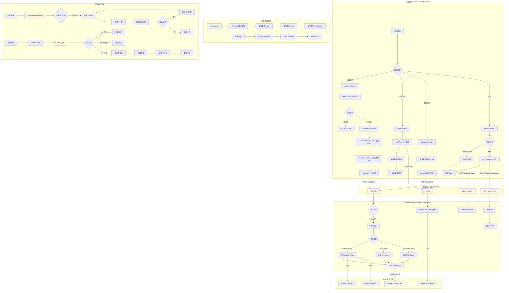
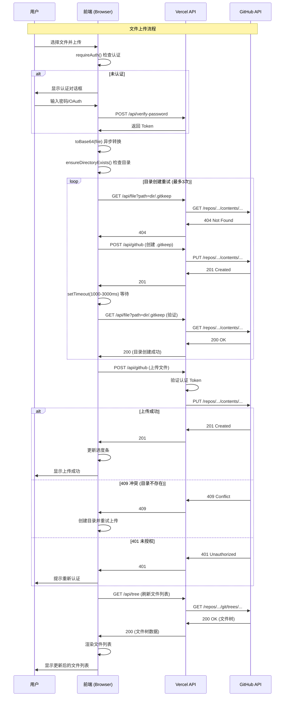
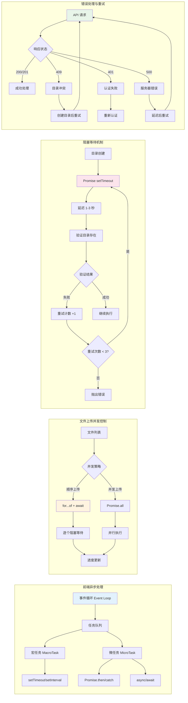
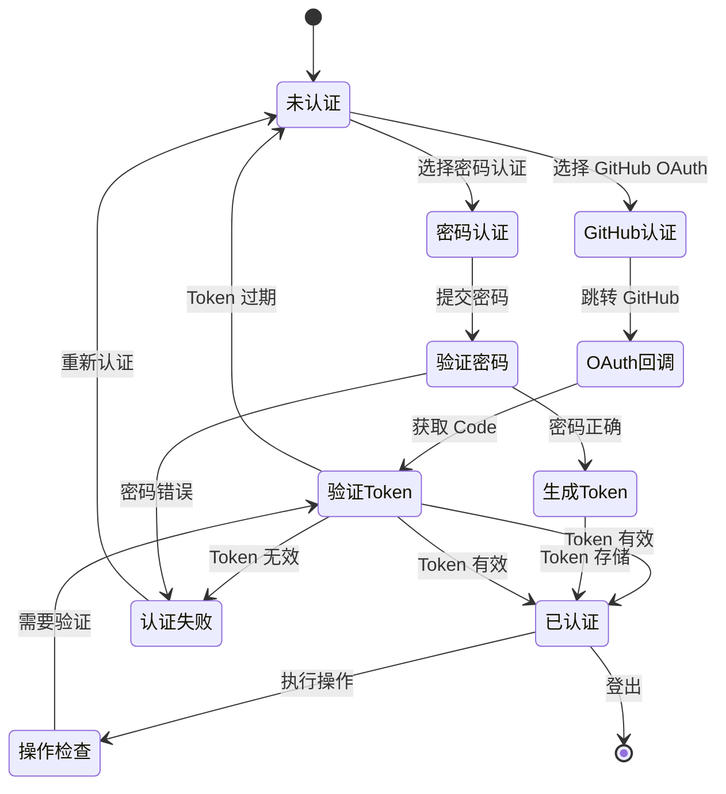

# picx-images-hosting 架构流程原理图

## 系统架构与异步处理流程

## 异步操作时序图

## 并发与阻塞处理机制

## 认证流程

## 关键特性说明

### 1. 异步处理
- **前端**: 使用 `async/await` 和 `Promise` 处理所有异步操作
- **API 调用**: 使用 `fetch` API 进行 HTTP 请求
- **文件操作**: 文件读取、Base64 转换都是异步的

### 2. 阻塞处理
- **目录创建**: 使用 `setTimeout` 延迟等待，确保 GitHub API 生效
- **重试机制**: 最多重试 3 次，每次重试间隔递增
- **顺序上传**: 使用 `for...of` 循环配合 `await` 实现顺序阻塞上传

### 3. 并发控制
- **文件上传**: 顺序上传（一个接一个），避免并发冲突
- **API 请求**: 每个请求独立执行，Vercel Serverless Functions 自动处理并发
- **前端渲染**: 使用事件循环和任务队列，非阻塞 UI 更新

### 4. 多进程/多实例
- **前端**: 单线程 JavaScript（浏览器主线程）
- **后端**: Vercel Serverless Functions（每个请求独立实例）
- **GitHub API**: 外部服务，支持并发请求

### 5. 错误处理
- **重试机制**: 自动重试失败的请求
- **错误捕获**: 使用 `try/catch` 和 `Promise.catch`
- **用户反馈**: 显示错误信息和重试提示

