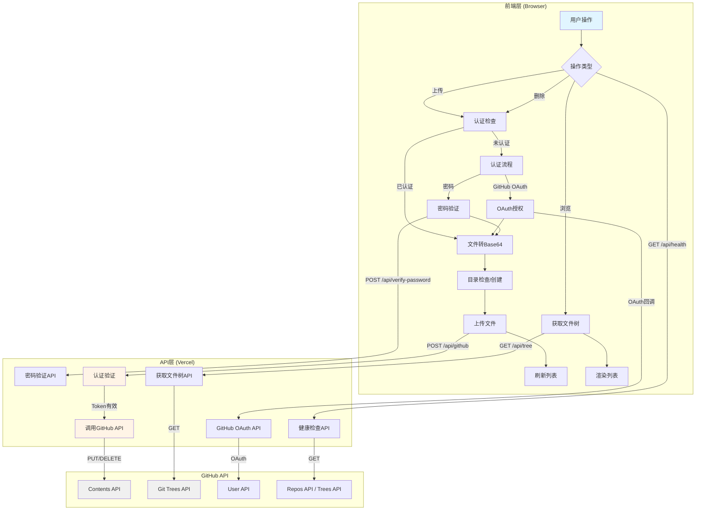
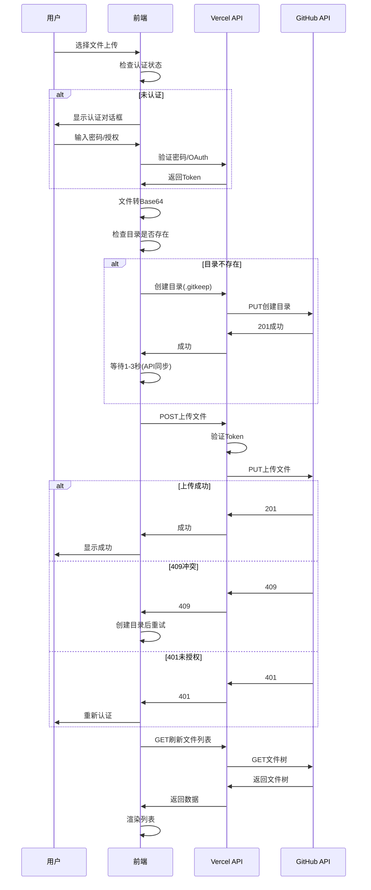
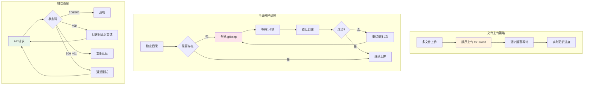
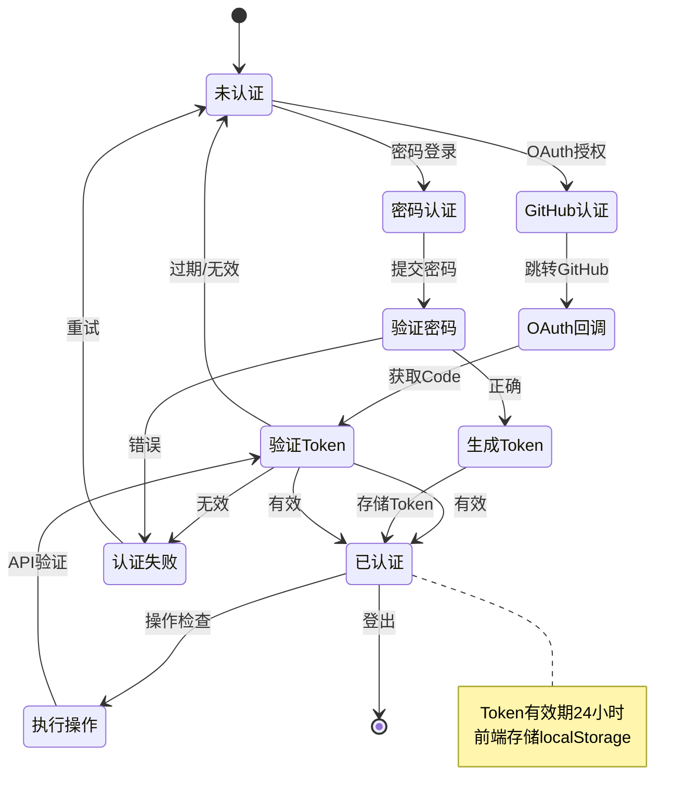

# picx-images-hosting 架构流程原理图

## 核心架构流程

## 文件上传时序图

## 关键处理机制

## 认证流程

## 核心机制说明

### 1. 认证机制
- **GitHub OAuth**: 用户授权后获取Token，后端验证Token有效性
- **密码认证**: 前端验证密码后生成Token，后端验证Token格式和时间戳
- **Token存储**: localStorage存储，有效期24小时

### 2. 目录创建策略
- **检查机制**: 通过检查`.gitkeep`文件判断目录是否存在
- **创建方式**: 创建`.gitkeep`文件来确保目录存在（GitHub特性）
- **同步等待**: GitHub API异步处理，需要等待1-3秒确保生效
- **重试机制**: 最多重试3次，每次间隔递增

### 3. 文件上传流程
- **顺序上传**: 使用`for...of + await`实现顺序阻塞上传，避免并发冲突
- **错误重试**: 409冲突时自动创建目录后重试，401时提示重新认证
- **进度反馈**: 实时更新上传进度，完成后自动刷新文件列表

### 4. 技术栈
- **前端**: 纯JavaScript，使用`async/await`处理异步，`fetch`进行API调用
- **后端**: Vercel Serverless Functions，每个请求独立实例
- **存储**: GitHub仓库，通过GitHub Contents API操作文件

### 5. 关键设计
- **安全性**: Token验证在后端完成，前端不存储敏感信息
- **可靠性**: 目录创建和文件上传都有重试机制
- **用户体验**: 实时进度反馈，错误提示清晰

